<!--
_class:
  # - invert
  - lead
-->


# PlantUML

https://plantuml.com/ja/

---


# 自己紹介
- yuki ohnaka
- 株式会社ナンバーフォー 🍀
  - Front-end engineer
  - Server-side engineer
  - Native-App engineer
- Vue / React / TypeScript / Java / PHP / Kotlin / Swift / Python / Docker / Ansible ...
- [Qiita](https://qiita.com/yuki0410_) / [Zenn](https://zenn.dev/yuki0410)
---

# PlantUML is...

- シンプルなテキストファイルで UML が書ける
- 色々な用途のダイアグラムに対応している
- UML以外にも色々な図に対応している
- 画像ファイル(png/svg)として出力ができる

---

<!--
_class:
  - lead
-->

# 対応しているダイアグラム

---

# シーケンス図

```
@startuml

Alice -> Bob: Authentication Request
Bob --> Alice: Authentication Response

Alice -> Bob: Another authentication Request
Alice <-- Bob: another authentication Response

@enduml
```

[Ref](https://plantuml.com/ja/sequence-diagram)

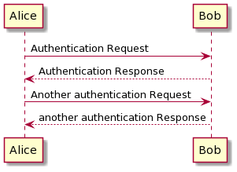

---

# ユースケース図

```
@startuml
User -> (Start)
User --> (Use the application) : A small label

:Main Admin: ---> (Use the application) : This is\nyet another\nlabel
@enduml
```

[Ref](https://plantuml.com/ja/use-case-diagram)

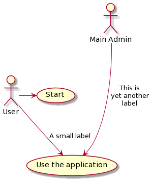

---

# クラス図

```
@startuml
class Car

Driver - Car : drives >
Car *- Wheel : have 4 >
Car -- Person : < owns
@enduml
```

[Ref](https://plantuml.com/ja/class-diagram)

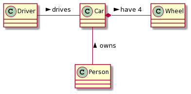

---

# アクティビティ図

```
@startuml

start
repeat :foo as starting label;
  :read data;
  :generate diagrams;
backward:This is backward;
repeat while (more data?)
stop

@enduml
```

[Ref](https://plantuml.com/ja/activity-diagram-beta)

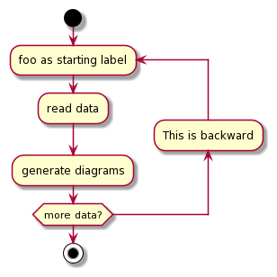

---

# コンポーネント図

```
@startuml

DataAccess - [First Component]
[First Component] ..> HTTP : use

@enduml
```

[Ref](https://plantuml.com/ja/component-diagram)

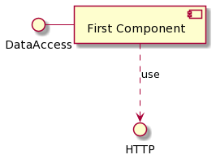

---

# 配置図

```
@startuml
node ノード1
node ノード2
node ノード3
node ノード4
ノード1 -- ノード2 : ラベル1
ノード1 .. ノード3 : ラベル2
ノード1 ~~ ノード4 : ラベル3
@enduml
```

[Ref](https://plantuml.com/ja/deployment-diagram)

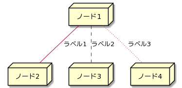

---

# ステート図

```
@startuml

[*] --> State1
State1 --> [*]
State1 : this is a string
State1 : this is another string
State1 -> State2
State2 --> [*]

@enduml
```

[Ref](https://plantuml.com/ja/state-diagram)

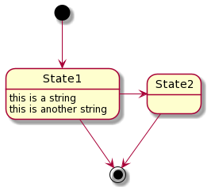

---

# タイミング図

```
@startuml
concise "ユーザ" as WU
scale 100 as 50 pixels

@WU
0 is 待機
+500 is ok
@enduml
```

[Ref](https://plantuml.com/ja/timing-diagram)

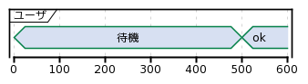

---

<!--
_class:
  - lead
-->

# ダイアグラム以外にも

---

# JSONデータ

```
@startjson
{
   "fruit":"Apple",
   "size":"Large",
   "color":"Red",
   "nest": {
      "key": "value"
   }
}
@endjson
```

[Ref](https://plantuml.com/ja/json)

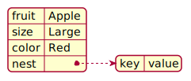

---

# YAMLデータ

```
@startyaml
fruit: Apple
size: Large
color: Red
nest:
   key: value
@endyaml
```

[Ref](https://plantuml.com/ja/yaml)


---

# ネットワーク図

```
@startuml
nwdiag {
  network dmz {
      address = "210.x.x.x/24"
      web01 [address = "210.x.x.1"];
  }
  network internal {
      address = "172.x.x.x/24";
      web01 [address = "172.x.x.1"];
      db01;
  }
}
@enduml
```

[Ref](https://plantuml.com/ja/nwdiag)

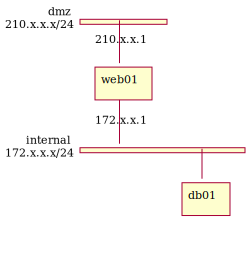

---

# ER図

```
@startuml
entity "Entity01" as e01 {
  *e1_id : number <<generated>>
  --
  *name : text
}
entity "Entity02" as e02 {
  *e2_id : number <<generated>>
  --
  *e1_id : number <<FK>>
}
e01 ||..o{ e02
@enduml
```

[Ref](https://plantuml.com/ja/ie-diagram)

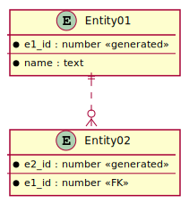

---

# ほかにも

- ワイヤーフレーム - [Ref](https://plantuml.com/ja/salt)
- アーキテクチャ図 - [Ref](https://plantuml.com/ja/archimate-diagram)
- ガントチャート - [Ref](https://plantuml.com/ja/gantt-diagram)
- マインドマップ - [Ref](https://plantuml.com/ja/mindmap-diagram)
- WBS図(作業分解図) - [Ref](https://plantuml.com/ja/wbs-diagram)

---

# なぜPlantUMLなのか

- テキストで書けるのでバージョン管理がしやすい
- 編集ツールに依存しない
- 自動レイアウト

---

# PlantUMLのつらいところ

- 自動レイアウトが思い通りにならない
- 記法を覚えなくてはいけない
- 標準テーマがダサい

---

<!--
_class:
  - invert
  - lead
-->

# Live Demo


---

# まとめ

- 色々な図に対応してるが、使いたいものだけ覚えて使えばいい
- サクッとある程度の図が書ける
  - 内部向け資料に向いている
- テキストベース
  - エディタは何でもいい
  - バージョン管理しやすい

---

<!--
_class:
  - invert
  - lead
-->

# ご清聴ありがとうございました 👏👏👏

---

<!--
_class:
  - lead
-->

# おまけ

---


# 環境構築の一例 ①

- [Chrome Extension - PlantUML Viewer](https://chrome.google.com/webstore/detail/plantuml-viewer/legbfeljfbjgfifnkmpoajgpgejojooj?hl=ja-JP)

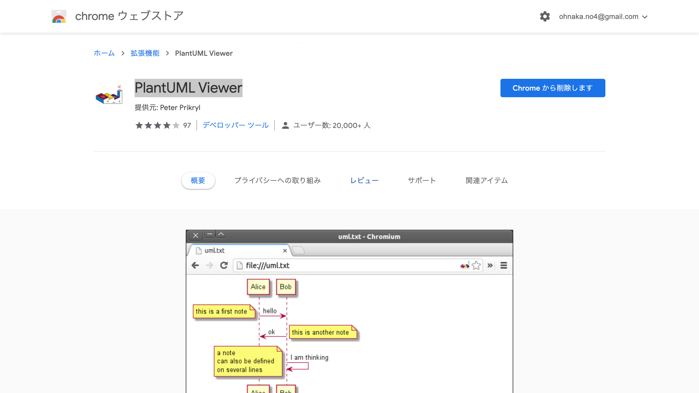

---

# 環境構築の一例 ②

- [VSCode Plugin - PlantUML](https://marketplace.visualstudio.com/items?itemName=jebbs.plantuml)
  - [VSCodeで始めるPlantUML生活](https://recruit.gmo.jp/engineer/jisedai/blog/plantuml/)

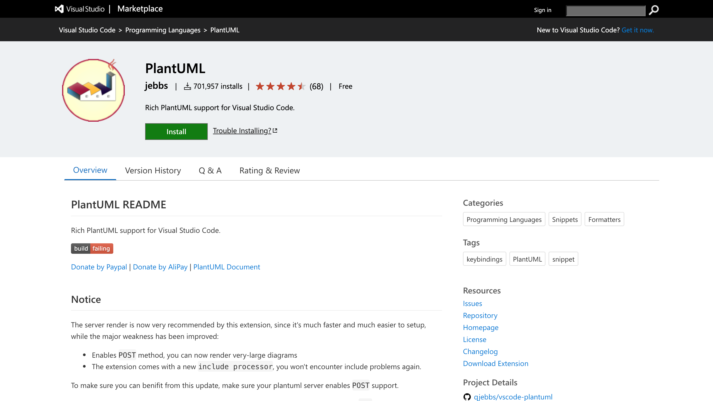
